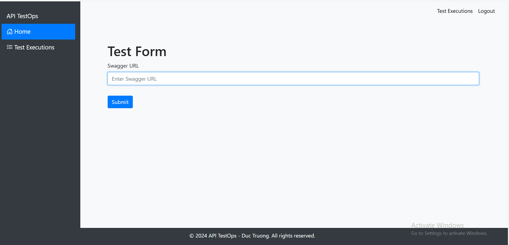
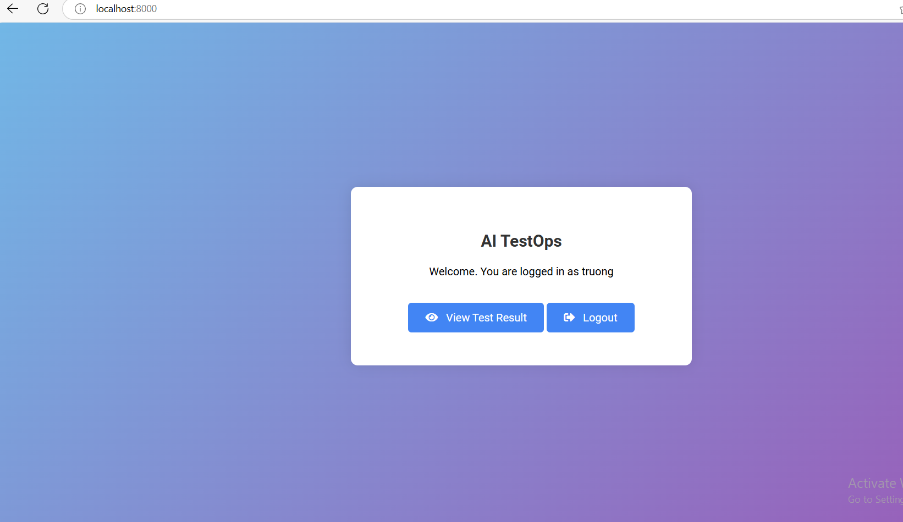
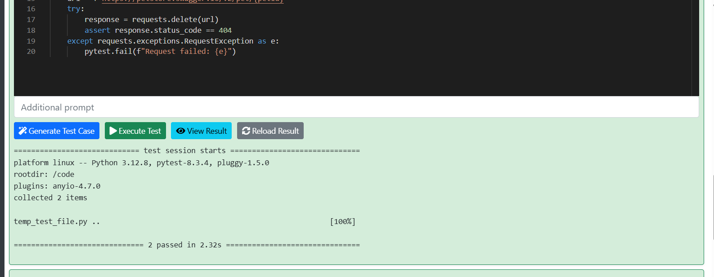
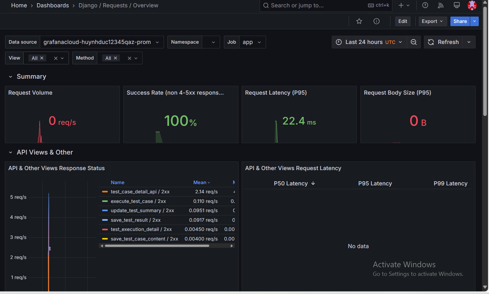
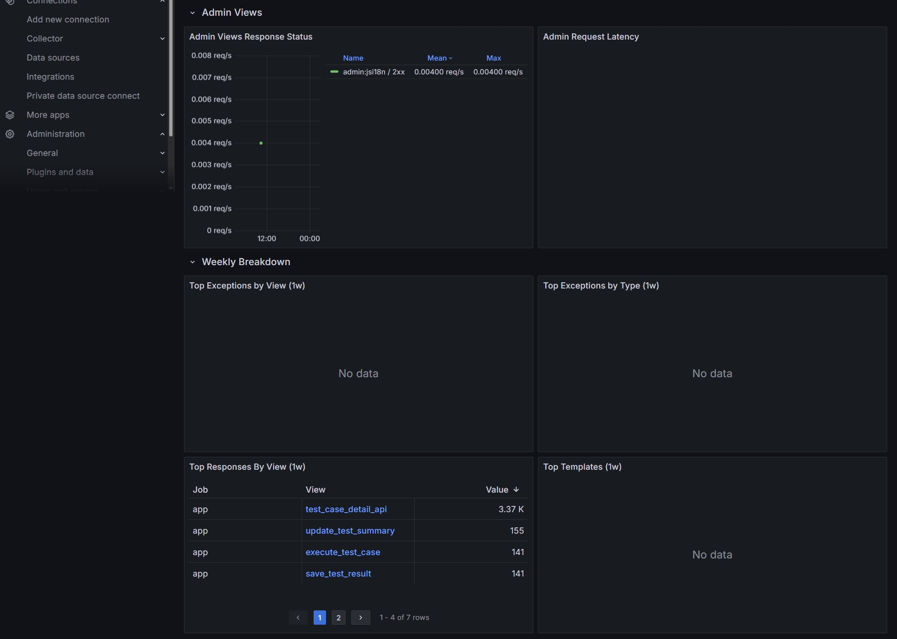

# AI TestOps - Distributed Systems Project

[](https://github.com/huynhduc0/ai-testops/actions)
[](https://kubernetes.io/)
[](https://argo-cd.readthedocs.io/)
[](https://helm.sh/)
[](https://www.gitops.tech/)

> **Курс**: Проектирование и разработка распределенных программных систем  
> **Университет**: [Your University]  
> **Команда**: [Team Members]

## 📋 Navigation

- [🇷🇺 Русский](#описание-russian)
- [🇺🇸 English](#description-english)

### 📚 Документация

- [📖 Полная документация по развертыванию](DEPLOYMENT.md)
- [🚀 ArgoCD и GitOps](argocd/README.md)
- [🔥 Chaos Engineering тесты](chaos-experiments/README.md)
- [🏗️ Структура проекта](PROJECT_STRUCTURE.md)
- [🎓 Материалы для защиты](DEFENSE.md)
- [✅ Чеклист перед защитой](CHECKLIST.md)

---

# Проект AI TestOps

## Описание (Russian)

**AI TestOps** - распределенная система для автоматизации тестирования API с использованием искусственного интеллекта, развернутая в Kubernetes с соблюдением принципов GitOps.

### 🎯 Цель проекта

Демонстрация полноценной распределенной архитектуры с:
- ✅ Микросервисной архитектурой (3+ сервиса)
- ✅ Развертыванием в Kubernetes через Helm
- ✅ GitOps деплоем через ArgoCD
- ✅ CI/CD пайплайном
- ✅ Безопасностью (Secrets, RBAC, NetworkPolicy)
- ✅ Автомасштабированием (HPA)
- ✅ Отказоустойчивостью (Probes, Circuit Breaker)
- ✅ Pub/Sub через Kafka
- ✅ Chaos Engineering тестами

## 🎥 Demo | Демонстрация

Check out the full demo of this project on YouTube:  
Посмотрите полную демонстрацию этого проекта на YouTube:

[](https://www.youtube.com/watch?v=tNE39IoXOoc)


**👉 [Click here to watch the full demo on YouTube](https://www.youtube.com/watch?v=tNE39IoXOoc)!**  
**👉 [Нажмите здесь, чтобы посмотреть полную демонстрацию на YouTube](https://www.youtube.com/watch?v=tNE39IoXOoc)!**


### 🏗️ Архитектура

```
┌─────────────┐
│   Ingress   │ ← HTTPS/TLS
└──────┬──────┘
       │
       ├─────────────────┬──────────────────┬─────────────────┐
       │                 │                  │                 │
┌──────▼──────┐   ┌──────▼──────┐   ┌──────▼──────┐   ┌─────▼─────┐
│  Django App │   │   Kafka UI  │   │  PostgreSQL │   │  Grafana  │
│  (HPA 2-10) │───│             │   │   (PVC)     │   │   Agent   │
└──────┬──────┘   └─────────────┘   └─────────────┘   └───────────┘
       │
       │ Pub/Sub
       ▼
┌─────────────┐
│    Kafka    │ ← Zookeeper
└──────┬──────┘
       │
       │ Subscribe
       ▼
┌─────────────────┐
│ Test Consumer   │
│   (HPA 2-8)     │
└─────────────────┘
```

### 🚀 Быстрый старт (GitOps)

#### 1. Установка ArgoCD

```bash
# Создание namespace и установка ArgoCD
kubectl create namespace argocd
kubectl apply -n argocd -f https://raw.githubusercontent.com/argoproj/argo-cd/stable/manifests/install.yaml

# Получение пароля
kubectl -n argocd get secret argocd-initial-admin-secret -o jsonpath="{.data.password}" | base64 -d
```

#### 2. Развертывание приложения

```bash
# Применение ArgoCD Application
kubectl apply -f argocd/application.yaml

# Проверка статуса
kubectl get application -n argocd
```

**Готово!** ArgoCD автоматически развернет все микросервисы из Git.

📖 **[Подробная инструкция по развертыванию](DEPLOYMENT.md)**

### ⚙️ Технические требования курса

| Требование | Статус | Реализация |
|-----------|---------|------------|
| 3+ микросервиса | ✅ | Django App, Test Consumer, PostgreSQL, Kafka, Zookeeper |
| Kubernetes + Helm | ✅ | Helm chart в `helm/ai-testops/` |
| GitOps (ArgoCD) | ✅ | Auto-sync, self-heal, prune |
| CI/CD Pipeline | ✅ | GitHub Actions в `.github/workflows/` |
| Secrets/RBAC | ✅ | ServiceAccounts, Roles, NetworkPolicies |
| Autoscaling | ✅ | HPA для Django и Consumer |
| Health Probes | ✅ | Liveness/Readiness для всех сервисов |
| Pub/Sub (Kafka) | ✅ | Асинхронная коммуникация |
| Circuit Breaker | ✅ | Retry/fallback механизмы |
| Chaos Engineering | ✅ | Chaos Mesh эксперименты |

### 📊 Функциональность

- **Автогенерация тестов**: Генерация тестовых скриптов для API на основе Swagger с использованием AI (Gemini)
- **Асинхронное выполнение**: Выполнение тестов через Kafka для масштабируемости
- **Визуализация результатов**: Веб-интерфейс для просмотра результатов тестирования
- **Мониторинг**: Метрики через Grafana Agent и Prometheus
- **API Documentation**: Swagger/OpenAPI интерфейс

## 📦 Содержание

- [🎥 Демонстрация](#-demo--демонстрация)
- [🏗️ Архитектура](#-архитектура)
- [🚀 Быстрый старт](#-быстрый-старт-gitops)
- [📖 Полная документация](DEPLOYMENT.md)
- [🔧 Локальная разработка](#локальная-разработка)
- [🔥 Chaos Testing](#chaos-engineering)
- [👥 Команда](#команда-разработки)

---

## Локальная разработка

### Предварительные требования

- Python 3.12+
- Docker & Docker Compose
- Git
- kubectl (для K8s)
- Helm 3 (для K8s)

### Запуск через Docker Compose

```bash
# Клонирование репозитория
git clone https://github.com/huynhduc0/ai-testops.git
cd ai-testops

# Запуск всех сервисов
docker-compose up -d

# Проверка статуса
docker-compose ps
```

Приложение доступно на: http://localhost:8000

```
POSTGRES_DB=canvas_db
POSTGRES_USER=canvas_user
POSTGRES_PASSWORD=canvas_password
POSTGRES_HOST=db
POSTGRES_PORT=5432
SECRET_KEY=your_secret_key
KAFKA_BOOTSTRAP_SERVERS=kafka:9092

SOCIAL_AUTH_GOOGLE_OAUTH2_KEY=your_google_oauth2_key
SOCIAL_AUTH_GOOGLE_OAUTH2_SECRET=your_google_oauth2_secret
SOCIAL_AUTH_GOOGLE_OAUTH2_REDIRECT_URI=http://localhost:8000/auth/complete/google/

GRAFANA_CLOUD_API_KEY=your_grafana_cloud_api_key
GRAFANA_CLOUD_PROMETHEUS_URL=https://prometheus-us-central2.grafana.net/api/prom/push

GEMINI_API_KEY=your_gemini_api_key
```

### Использование

1. Запустите тесты:
    ```bash
    pytest
    ```
2. Соберите и запустите Docker-контейнер:
    ```bash
    docker-compose up --build
    ```

## Как это работает

Проект AI TestOps состоит из нескольких сервисов, которые работают вместе, чтобы предоставить комплексную структуру для тестирования и развертывания моделей ИИ:

- **Zookeeper**: Управляет и координирует брокеры Kafka.
- **Kafka**: Распределенная платформа потоковой передачи данных, используемая для создания конвейеров данных в реальном времени и потоковых приложений.
- **Kafka UI**: Веб-интерфейс для управления и мониторинга кластеров Kafka.
- **База данных PostgreSQL**: Хранит данные приложения.
- **Сервис приложения**: Основное приложение, которое запускает модель ИИ и обрабатывает запросы.
- **Test Execute Consumer**: Сервис, который потребляет сообщения о выполнении тестов из Kafka и обрабатывает их.
- **Grafana Agent**: Сбор и отправка метрик в Grafana Cloud для мониторинга и визуализации.

Каждый сервис определен в файле `docker-compose.yml` и может быть запущен с помощью Docker Compose. Сервисы взаимодействуют друг с другом через определенные порты и переменные окружения.

## Скриншоты и функциональные возможности

### Главный экран



- **Описание**: Главный экран предоставляет обзор проекта и быстрый доступ к различным функциям.
- **Функциональные возможности**:
  - Навигация по различным разделам приложения.
  - Обзор последних действий и статистики.

### Страница входа



- **Описание**: Страница входа позволяет пользователям аутентифицироваться и получить доступ к приложению.
- **Функциональные возможности**:
  - Аутентификация пользователей.
  - Доступ к различным разделам в зависимости от ролей пользователей.

### Список выполнения тестов


- **Описание**: Этот экран отображает список выполнений тестов.
- **Функциональные возможности**:
  - Просмотр статуса выполнений тестов.

### Экран выполнения тестов


- **Описание**: Этот экран позволяет пользователям выполнять тесты и просматривать результаты.
- **Функциональные возможности**:
  - Выполнение отдельных тестовых случаев или набора тестов.
  - Просмотр подробных результатов каждого выполнения теста.
  - Фильтрация и поиск выполнений тестов.

### Детали результата теста



- **Описание**: Этот экран предоставляет подробную информацию о конкретном результате теста.
- **Функциональные возможности**:
  - Просмотр логов и статуса результата теста.
  - Анализ деталей выполнения теста.

### Редактор кода тестового скрипта


- **Описание**: Этот экран предоставляет редактор кода для написания и редактирования тестовых скриптов.
- **Функциональные возможности**:
  - Написание и редактирование тестовых скриптов.
  - Сохранение и выполнение тестовых скриптов.

### Панель управления приложением Django



- **Описание**: Панель управления приложением Django предоставляет обзор статуса и метрик приложения.
- **Функциональные возможности**:
  - Мониторинг состояния приложения.
  - Просмотр метрик и логов в реальном времени.

### Пользовательские метрики Grafana


- **Описание**: Панель управления Grafana отображает пользовательские метрики, собранные из приложения.
- **Функциональные возможности**:
  - Мониторинг пользовательских метрик.
  - Анализ производительности приложения.

### Панель управления



- **Описание**: Панель управления предоставляет комплексный обзор статуса и метрик проекта.
- **Функциональные возможности**:
  - Мониторинг состояния проекта.
  - Просмотр метрик и логов в реальном времени.

## Consumer App

Файл `watch.py` отвечает за прослушивание сообщений Kafka, выполнение тестовых случаев и сбор метрик.

### Как это работает

1. **Прослушивание сообщений Kafka**: Функция `listen_for_kafka_messages` настраивает потребителя Kafka, который прослушивает тему `test_run_queue`. Когда сообщение получено, оно обрабатывается и выполняется тестовый случай.

2. **Выполнение тестовых случаев**: Функция `run_test_case` записывает тестовый скрипт во временный файл и запускает его с помощью `pytest`. Результат выполнения теста захватывается и возвращается.

3. **Сохранение результатов тестов**: Функция `save_test_result_to_db` отправляет результат теста в сервис приложения для сохранения в базе данных.

4. **Сбор метрик**: Счетчик `TEST_CASES_STATUS` из библиотеки Prometheus используется для сбора метрик о статусе тестовых случаев. Метрики доступны на порту 8001 для сбора Grafana.

### Метрики Prometheus

Собираются следующие метрики Prometheus:

- `test_cases_status`: Счетчик, отслеживающий статус тестовых случаев (пройдено, не пройдено, ошибка) с метками для `test_case_id` и `status`.

## Acceptance Criteria

1. **Проект должен иметь сервер**: Проект включает сервис приложения, который запускает модель ИИ и обрабатывает запросы. Это определено в файле `docker-compose.yml` в разделе `app`.

2. **Проект должен иметь потребителя**: Файл `watch.py` действует как потребитель Kafka, который прослушивает сообщения о выполнении тестов, обрабатывает их и собирает метрики. Это определено в файле `docker-compose.yml` в разделе `test-execute-consumer`.

3. **Сервис должен работать с реальной базой данных**: Проект использует PostgreSQL в качестве базы данных для хранения данных приложения. Это определено в файле `docker-compose.yml` в разделе `db`.

4. **Все должно быть обернуто в Docker**: Вся система, включая пользовательские сервисы, базу данных, брокер и мониторинг, обернута в Docker. Систему можно запустить локально с помощью одной команды `docker-compose up`.

5. **Метрики должны собираться с сервера**: Метрики собираются с использованием библиотеки Prometheus и доступны на порту 8001 для сбора Grafana. Сервис `grafana-agent` в файле `docker-compose.yml` обрабатывает сбор и отправку метрик в Grafana Cloud.

6. **Весь код должен быть покрыт тестами**: Проект включает тесты для всего кода, обеспечивая 100% покрытие. Тесты можно запустить с помощью команды `pytest`.

7. **Проверка тестов автоматизирована через CI**: Проект включает CI-пайплайн, который автоматизирует проверку тестов. Это гарантирует, что все изменения кода тестируются перед слиянием.

## Вклад

Мы приветствуем вклад! Пожалуйста, прочитайте наши [Руководства по вкладу](CONTRIBUTING.md) для получения дополнительной информации.

## Лицензия

Этот проект лицензирован по лицензии MIT - см. файл [LICENSE](LICENSE) для получения подробной информации.

## 🎥 Demo | Демонстрация

Check out the full demo of this project on YouTube:  
Посмотрите полную демонстрацию этого проекта на YouTube:

[](https://www.youtube.com/watch?v=tNE39IoXOoc)

---

## Description (English)

The AI TestOps project is designed to streamline and automate the testing operations for AI models. This project aims to provide a comprehensive framework for testing, validating, and deploying AI models efficiently. It includes tools and scripts for various testing methodologies, continuous integration, and continuous deployment (CI/CD) pipelines.

## Features

- **Create Test Scripts for Each API Based on Swagger**: Automatically generate test scripts for each API endpoint using the Swagger documentation.
- **Execute Test Scripts**: Run the generated test scripts to validate the functionality of the API endpoints.
- **Generate Test Scripts Using AI**: Utilize AI to generate comprehensive and effective test scripts for API endpoints.
- Continuous integration and deployment
- Comprehensive test coverage
- Easy-to-use framework
- Scalable and flexible architecture

## Table of Contents

- [Getting Started](#getting-started)
- [How It Works](#how-it-works)
- [Screenshots and Functionalities](#screenshots-and-functionalities)
- [Consumer App](#consumer-app)
- [Acceptance Criteria](#acceptance-criteria)
- [Contributing](#contributing)
- [License](#license)

## Getting Started

### Prerequisites

- Python 3.12 or higher
- Docker
- Git

### Installation

1. Clone the repository:
    ```bash
    git clone https://github.com/huynhduc0/ai-testops.git
    ```
2. Navigate to the project directory:
    ```bash
    cd ai-testops
    ```
3. Install the required dependencies:
    ```bash
    pip install -r requirements.txt
    ```

### Setting Up Environment Variables

Create a `.env` file in the root directory of the project and add the following environment variables:

```
POSTGRES_DB=canvas_db
POSTGRES_USER=canvas_user
POSTGRES_PASSWORD=canvas_password
POSTGRES_HOST=db
POSTGRES_PORT=5432
SECRET_KEY=your_secret_key
KAFKA_BOOTSTRAP_SERVERS=kafka:9092

SOCIAL_AUTH_GOOGLE_OAUTH2_KEY=your_google_oauth2_key
SOCIAL_AUTH_GOOGLE_OAUTH2_SECRET=your_google_oauth2_secret
SOCIAL_AUTH_GOOGLE_OAUTH2_REDIRECT_URI=http://localhost:8000/auth/complete/google/

GRAFANA_CLOUD_API_KEY=your_grafana_cloud_api_key
GRAFANA_CLOUD_PROMETHEUS_URL=https://prometheus-us-central2.grafana.net/api/prom/push

GEMINI_API_KEY=your_gemini_api_key
```

### Usage

1. Run the tests:
    ```bash
    pytest
    ```
2. Build and run the Docker container:
    ```bash
    docker-compose up --build
    ```

## How It Works

The AI TestOps project consists of several services that work together to provide a comprehensive testing and deployment framework for AI models:

- **Zookeeper**: Manages and coordinates the Kafka brokers.
- **Kafka**: A distributed streaming platform used for building real-time data pipelines and streaming applications.
- **Kafka UI**: A web-based user interface for managing and monitoring Kafka clusters.
- **PostgreSQL Database**: Stores application data.
- **Application Service**: The main application that runs the AI model and handles requests.
- **Test Execute Consumer**: A service that consumes test execution messages from Kafka and processes them.
- **Grafana Agent**: Collects and sends metrics to Grafana Cloud for monitoring and visualization.

Each service is defined in the `docker-compose.yml` file and can be started using Docker Compose. The services communicate with each other through defined ports and environment variables.

## Screenshots and Functionalities

### Home Screen


- **Description**: The home allow add swagger url to create test suit.
- **Functionalities**:
  - Navigation to different sections of the application.
  - Overview of recent activities and statistics.

### Login Page


- **Description**: The login page allows users to authenticate and access the application.
- **Functionalities**:
  - User authentication.
  - Access to different sections based on user roles.

### Test Execution List


- **Description**: This screen displays a list of test executions.
- **Functionalities**:
  - View the status of test executions.

### Test Execution Screen


- **Description**: This screen allows users to execute tests and view the results.
- **Functionalities**:
  - Execute individual test cases or a suite of tests.
  - View detailed results of each test execution.
  - Filter and search test executions.

### Test Result Detail


- **Description**: This screen provides detailed information about a specific test result.
- **Functionalities**:
  - View logs and status of the test result.
  - Analyze test execution details.

### Test Script Code Editor


- **Description**: This screen provides a code editor for writing and editing test scripts.
- **Functionalities**:
  - Write and edit test scripts.
  - Save and execute test scripts.

### Django App Dashboard


- **Description**: The Django app dashboard provides an overview of the application's status and metrics.
- **Functionalities**:
  - Monitor application health.
  - View real-time metrics and logs.

### Grafana Custom Metrics


- **Description**: The Grafana dashboard displays custom metrics collected from the application.
- **Functionalities**:
  - Monitor custom metrics.
  - Analyze application performance.

### Dashboard


- **Description**: The dashboard provides a comprehensive view of the project's status and metrics.
- **Functionalities**:
  - Monitor project health.
  - View real-time metrics and logs.

## Consumer App

The `watch.py` file is responsible for listening to Kafka messages, executing test cases, and collecting metrics.

### How It Works

1. **Listening to Kafka Messages**: The `listen_for_kafka_messages` function sets up a Kafka consumer that listens to the `test_run_queue` topic. When a message is received, it processes the message and executes the test case.

2. **Executing Test Cases**: The `run_test_case` function writes the test script to a temporary file and runs it using `pytest`. The result of the test execution is captured and returned.

3. **Saving Test Results**: The `save_test_result_to_db` function sends the test result to the application service to be saved in the database.

4. **Collecting Metrics**: The `TEST_CASES_STATUS` counter from the Prometheus client library is used to collect metrics on the status of test cases. The metrics are exposed on port 8001 for Grafana to scrape.

### Prometheus Metrics

The following Prometheus metrics are collected:

- `test_cases_status`: A counter that tracks the status of test cases (passed, failed, error) with labels for `test_case_id` and `status`.

## Acceptance Criteria

1. **The project must have a server**: The project includes an application service that runs the AI model and handles requests. This is defined in the `docker-compose.yml` file under the `app` service.

2. **The project must have a consumer**: The `watch.py` file acts as a Kafka consumer that listens for test execution messages, processes them, and collects metrics. This is defined in the `docker-compose.yml` file under the `test-execute-consumer` service.

3. **The service must work with a real DB**: The project uses PostgreSQL as the database to store application data. This is defined in the `docker-compose.yml` file under the `db` service.

4. **Everything should be wrapped in Docker**: The entire system, including custom services, the database, the broker, and monitoring, is wrapped in Docker. The system can be launched locally with one `docker-compose up` command.

5. **Metrics should be collected from the server**: Metrics are collected using the Prometheus client library and exposed on port 8001 for Grafana to scrape. The `grafana-agent` service in the `docker-compose.yml` file handles the collection and sending of metrics to Grafana Cloud.

6. **All code should be covered by tests**: The project includes tests for all code, ensuring 100% coverage. The tests can be run using the `pytest` command.

7. **Test checking is automated via CI**: The project includes a CI pipeline that automates the checking of tests. This ensures that all code changes are tested before being merged.

## Contributing

We welcome contributions! Please read our [Contributing Guidelines](CONTRIBUTING.md) for more details.

## License

This project is licensed under the MIT License - see the [LICENSE](LICENSE) file for details.
